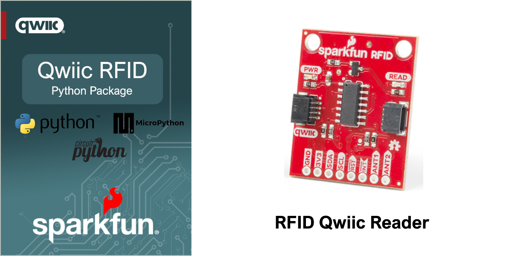

# SparkFun Qwiic RFID - Python Package


[](https://docs.sparkfun.com/qwiic_rfid_py/classqwiic__rfid_1_1_qwiic_r_f_i_d.html)

The SparkFun Qwiic RFID Reader RFID Module provides a simple and cost effective solution for adding RFID Reader capabilities to your project. Implementing a SparkFun Qwiic I2C interface, these sensors can be rapidly added to any project with boards that are part of the SparkFun Qwiic ecosystem.

This repository implements a Python package for the SparkFun Qwiic RFID. This package works with Python, MicroPython and CircuitPython.

### Contents

* [About](#about-the-package)
* [Getting Started](#getting-started)
* [Installation](#installation)
* [Supported Platforms](#supported-platforms)
* [Documentation](https://docs.sparkfun.com/qwiic_rfid_py/classqwiic__rfid_1_1_qwiic_r_f_i_d.html)
* [Examples](#examples)

## About the Package

This python package enables the user to access the features of the RFID via a single Qwiic cable. This includes <getting tags, changing I2C address, > and more. The capabilities of the RFID are each demonstrated in the included examples.

New to qwiic? Take a look at the entire [SparkFun qwiic ecosystem](https://www.sparkfun.com/qwiic).

### Supported SparkFun Products

This Python package supports the following SparkFun qwiic products on Python, MicroPython and Circuit python. 

* [SparkFun RFID Reader Sensor - RFID](https://www.sparkfun.com/products/15191)

### Supported Platforms

| Python | Platform | Boards |
|--|--|--|
| Python | Linux | [Raspberry Pi](https://www.sparkfun.com/raspberry-pi-5-8gb.html) , [NVIDIA Jetson Orin Nano](https://www.sparkfun.com/nvidia-jetson-orin-nano-developer-kit.html) via the [SparkFun Qwiic SHIM](https://www.sparkfun.com/sparkfun-qwiic-shim-for-raspberry-pi.html) |
| MicroPython | Raspberry Pi - RP2, ESP32 | [SparkFun RP2040 Thing+](https://www.sparkfun.com/sparkfun-thing-plus-rp2040.html), [SparkFun RP2350 Thing+](https://www.sparkfun.com/sparkfun-thing-plus-rp2350.html), [SparkFun ESP32 Thing+](https://www.sparkfun.com/sparkfun-thing-plus-esp32-wroom-usb-c.html)
|CircuitPython | Raspberry Pi - RP2, ESP32 | [SparkFun RP2040 Thing+](https://www.sparkfun.com/sparkfun-thing-plus-rp2040.html), [SparkFun RP2350 Thing+](https://www.sparkfun.com/sparkfun-thing-plus-rp2350.html), [SparkFun ESP32 Thing+](https://www.sparkfun.com/sparkfun-thing-plus-esp32-wroom-usb-c.html)

> [!NOTE]
> The listed supported platforms and boards are the primary platform targets tested. It is fully expected that this package will work across a wide variety of Python enabled systems. 

## Installation 

The first step to using this package is installing it on your system. The install method depends on the python platform. The following sections outline installation on Python, MicroPython and CircuitPython.

### Python 

#### PyPi Installation

The package is primarily installed using the `pip3` command, downloading the package from the Python Index - "PyPi". 

Note - the below instructions outline installation on a Linux-based (Raspberry Pi) system.

First, setup a virtual environment from a specific directory using venv:
```sh
python3 -m venv path/to/venv
```
You can pass any path as path/to/venv, just make sure you use the same one for all future steps. For more information on venv [click here](https://docs.python.org/3/library/venv.html).

Next, install the qwiic package with:
```sh
path/to/venv/bin/pip3 install sparkfun-qwiic-rfid
```
Now you should be able to run any example or custom python scripts that have `import qwiic_rfid` by running e.g.:
```sh
path/to/venv/bin/python3 example_script.py
```

### MicroPython Installation
If not already installed, follow the [instructions here](https://docs.micropython.org/en/latest/reference/mpremote.html) to install mpremote on your computer.

Connect a device with MicroPython installed to your computer and then install the package directly to your device with mpremote mip.
```sh
mpremote mip install github:sparkfun/qwiic_rfid_py
```

If you would also like to install the examples for this repository, issue the following mip command as well:
```sh
mprmeote mip install github:sparkfun/qwiic_rfid_py@examples
```

### CircuitPython Installation
If not already installed, follow the [instructions here](https://docs.circuitpython.org/projects/circup/en/latest/#installation) to install CircUp on your computer.

Ensure that you have the latest version of the SparkFun Qwiic CircuitPython bundle. 
```sh
circup bundle-add sparkfun/Qwiic_Py
```

Finally, connect a device with CircuitPython installed to your computer and then install the package directly to your device with circup.
```sh
circup install --py qwiic_rfid
```

If you would like to install any of the examples from this repository, issue the corresponding circup command from below. (NOTE: The below syntax assumes you are using CircUp on Windows. Linux and Mac will have different path seperators. See the [CircUp "example" command documentation](https://learn.adafruit.com/keep-your-circuitpython-libraries-on-devices-up-to-date-with-circup/example-command) for more information)

```sh
circup example qwiic_rfid\qwiic_rfid_ex1_getTag
circup example qwiic_rfid\qwiic_rfid_ex2_getAllTags
circup example qwiic_rfid\qwiic_rfid_ex3_changeI2Caddress
```

Example Use
 ---------------
Below is a quickstart program to print readings from the RFID.

See the examples directory for more detailed use examples and [examples/README.md](https://github.com/sparkfun/qwiic_rfid_py/blob/main/examples/README.md) for a summary of the available examples.

```python

import qwiic_rfid
import time
import sys

def run_example():

    print("\nSparkFun Qwiic RFID Reader Example 1")
    my_RFID = qwiic_rfid.QwiicRFID()

    if my_RFID.begin() == False:
        print("\nThe Qwiic RFID Reader isn't connected to the system. Please check your connection", file=sys.stderr)
        return
    
    print("\nReady to scan some tags!")
    
    while True:
        tag_id = my_RFID.get_tag()
        
        if tag_id != "000000":
            print("\n Tag scanned!")
            print("Tag ID: " + tag_id)

            scan_time = my_RFID.get_prec_req_time()
            print("Scanned " + str(scan_time) + " seconds ago")
        
        time.sleep(1)

if __name__ == '__main__':
    try:
        run_example()
    except (KeyboardInterrupt, SystemExit) as exErr:
        print("\nEnding Example 1")
        sys.exit(0)

```
<p align="center">

</p>
